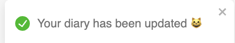
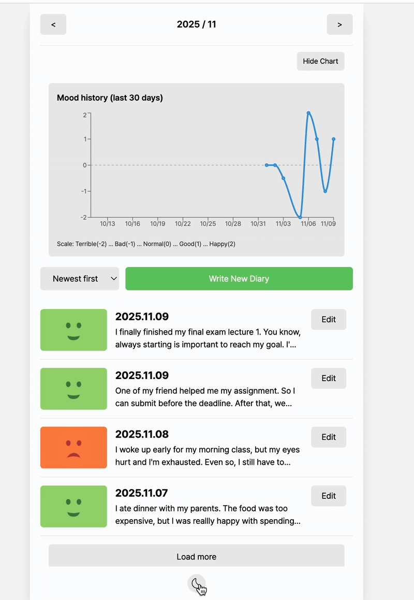
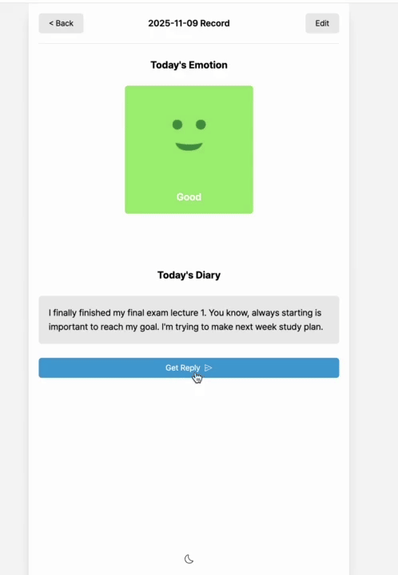

# Mood Diary 


## 📝 Project Overview

This project is a redesigned and upgraded version of the previous **Mood Diary** application.  
It was migrated to **Vite + TypeScript + Tailwind CSS**, and enhanced with:

<br>

## ⚙️ Tech Stack

| Category | Tools / Technologies | Description |
|---------|----------------------|-------------|
| **Frontend Framework** | React (Vite) | Fast development using Vite bundler and SPA architecture |
| **Language** | TypeScript | Strong typing for safer and maintainable code |
| **Styling** | TailwindCSS | Utility-first CSS with built-in dark mode support |
| **State Management** | React Context API | Managing theme and diary data globally |
| **UI Feedback** | React-Toastify | Toast notifications for user feedback (create/edit/delete) |
| **Routing** | React Router | Page navigation (Home / New / Edit / Diary) |
| **AI Integration** | OpenAI GPT API | AI reply generation + emotion classification |
| **Data Persistence** | LocalStorage | Storing diary entries and theme settings persistently |
| **Charts & Visualization** | Recharts | Emotion trend line chart by month |
| **Build Tooling** | PostCSS / Autoprefixer | CSS transformations and vendor prefixing |
| **Icons** | React-Icons | Icon components for UI elements |
| **Deployment** | Vercel | Web application hosting and CI/CD |
| **Version Control** | Git & GitHub | Repository management and collaboration |


<br>

# 🌟 Key Features

## 1. Migration to Modern Stack

Migrated CRA → **Vite**, adopted **TypeScript** for type-safety, and **Tailwind CSS** for scalable styling.


<br>

## 2. Toast Notifications

Implemented with **React-Toastify** for create/edit/delete feedback.

| Create                        | Edit                       | Delete                        |
| ------------------------------------ | ------------------------------------ | ------------------------------------ |
|  |  |  |

<br>

## 3. Dark Mode Experience

Tailwind’s class-based dark mode with persistence via `localStorage`.

### 3-1 Theme and Color Configuration

**Config (example):**
```ts
// tailwind.config.ts
export default {
  darkMode: "class",
  content: ["./index.html", "./src/**/*.{ts,tsx}"],
  theme: { extend: {} },
  plugins: [],
};

### 3-2 Theme State Management

// context/theme-context.tsx
const ThemeContext = createContext({ isDarkMode: false, toggleDarkMode: () => {} });

export const ThemeProvider = ({ children }: { children: React.ReactNode }) => {
  const load = () => JSON.parse(localStorage.getItem("darkMode") || "false");
  const [isDarkMode, setIsDarkMode] = useState(load());

  useEffect(() => {
    const body = document.body;
    isDarkMode ? body.classList.add("dark") : body.classList.remove("dark");
    localStorage.setItem("darkMode", JSON.stringify(isDarkMode));
    return () => body.classList.remove("dark");
  }, [isDarkMode]);

  return (
    <ThemeContext.Provider value={{ isDarkMode, toggleDarkMode: () => setIsDarkMode(v => !v) }}>
      {children}
    </ThemeContext.Provider>
  );
};
export default ThemeContext;

```

#### 3-3 Dark Mode Toggle

Users can switch between dark mode and light mode by clicking the toggle button located in the footer.


<br>

## 4. AI Reply System

The project includes an AI reply system that analyzes the user's diary entry and generates:
- A one-line supportive advice
- AI-predicted emotion category
- Confidence score for the prediction

This feature is powered by the OpenAI Chat Completion API.

To use the AI features, you **must add your personal OpenAI API key** to a local environment file.

#### ✅ Setting up the API Key

Create a `.env.local` file in the project root:

```bash
touch .env.local
```

### ✅ How the AI Reply Works (CallGPT Function)

The AI reply is generated using the `CallGPT` function located in `src/api/gpt.ts`.

This function sends the user's diary content to OpenAI and receives a **strict JSON response** containing:

- `answer`: one-line supportive advice (English)
- `emotion`: one of `["happy", "good", "normal", "bad", "terrible"]`
- `confidence`: a number between `0` and `1`


This JSON output is then stored in the diary record and displayed on the Diary page.

---

### ✅ CallGPT Function (Full Source Code)

```ts
export const CallGPT = async ({ prompt }: { prompt: string }): Promise<{
  answer: string;
  emotion?: "happy" | "good" | "normal" | "bad" | "terrible";
  confidence?: number;
}> => {
  const messages = [
    { role: "system", content: "You are a Counseling Expert, specializing in personal development through diary writing." },
    { role: "user", content: `"""${prompt}"""` },
    {
      role: "user",
      content: `
Analyze the diary and respond in JSON only (no code fences). Fields:
- "answer": one-line supportive advice in English
- "emotion": one of ["happy","good","normal","bad","terrible"]
- "confidence": number between 0 and 1

STRICT JSON ONLY:
{"answer":"...", "emotion":"...", "confidence":0.85}
      `.trim(),
    },
  ];

  const apiKey = import.meta.env.VITE_GPT_API_KEY;
  if (!apiKey) throw new Error("Missing VITE_GPT_API_KEY");

  const res = await fetch("https://api.openai.com/v1/chat/completions", {
    method: "POST",
    headers: { "Content-Type": "application/json", Authorization: `Bearer ${apiKey}` },
    body: JSON.stringify({
      model: "gpt-4o-mini",
      messages,
      temperature: 0.7,
      max_tokens: 300,
    }),
  });

  if (!res.ok) {
    let detail = "";
    try {
      const j = await res.json();
      detail = j?.error?.message || JSON.stringify(j);
    } catch {
      detail = await res.text().catch(() => "");
    }
    throw new Error(`OpenAI HTTP ${res.status}: ${detail}`);
  }

  const data = await res.json();
  let content: string = data?.choices?.[0]?.message?.content?.toString()?.trim() || "";
  content = content.replace(/```json|```/g, "").trim();

  const s = content.indexOf("{");
  const e = content.lastIndexOf("}");
  const candidate = s >= 0 && e > s ? content.slice(s, e + 1) : content;

  try {
    const parsed = JSON.parse(candidate);
    return {
      answer: String(parsed.answer || ""),
      emotion: parsed.emotion,
      confidence: typeof parsed.confidence === "number" ? parsed.confidence : undefined,
    };
  } catch {
    return { answer: content };
  }
};

```

## 5. Emotion Comparison (User vs AI)

This section compares the **user-selected emotion** with the **AI-predicted emotion** and displays:
- The AI’s predicted emotion and confidence
- A **Match Rate (%)** between User vs AI
- A small visual indicator (progress bar)

The comparison helps evaluate **Human–AI agreement** and makes the diary more insightful.

---

### ✅ Data Model

Add AI fields to the diary type:

```ts
// src/types/diary-types.ts
import { Emotion } from "utils/emotion-utils";

export interface DiaryType {
  id: number;
  createdDate: number;
  emotion: Emotion;       // user-selected emotion
  content: string;
  gptAnswer?: string;

  aiEmotion?: Emotion;    // AI-predicted emotion
  aiConfidence?: number;  // 0..1
}

```
### ✅ Why it’s Useful
- Provides a transparent Human–AI agreement signal for each diary entry
- Encourages reflection: users can compare self-perceived mood vs. AI inference



## 6. Emotion History Chart

Visualize monthly mood trends with a lightweight line chart. This helps track changes over time and complements the AI comparison feature.

---

### ✅ Install

```bash
npm i recharts
```

### ✅ Notes
- The Y-axis uses a **-2 to 2 range**, mapped to Terrible → Happy.
- Days without entries render as gaps (null values).
- You can switch to a bar chart or area chart by replacing <LineChart/> with <BarChart/> or <AreaChart/> if desired.


### ✅ Toggle Chart Visibility

You can **show/hide** the Emotion History Chart from the Home page.

- Click the **“Show Chart / Hide Chart”** button to toggle visibility.
- This is useful when you want a compact list-only view.

<br>

### ✅ Load More for Long Diaries

If you have many diary entries in a month, the list initially renders a subset and shows a **“Load More”** button at the bottom.

- Click **“Load More”** to append the next batch of items.
- This keeps the page responsive while scrolling through large archives.

### 🗂️ Sorting Diaries (Newest ↔ Oldest)

The diary list supports **sorting by date** in two modes:

- **Newest first** — recent entries appear at the top  
- **Oldest first** — earlier entries appear first

## Installation & Execution

```bash
npm run dev
```

<br>


<br>

## Folder Structure

```bash
.
.
├── .env.local                 # ✅ OpenAI API key stored here (not committed to Git)
├── README.md
├── index.html
├── package-lock.json
├── package.json
├── postcss.config.js
├── public
├── src
│   ├── App.css
│   ├── App.tsx
│   ├── api
│   │   ├── gpt.ts              # GPT reply + emotion classification (JSON output)
│   │   └── analyzeEmotion.ts   # (Optional) Local emotion analyzer / OpenAI fallback
│   ├── assets                  # Images & static files
│   │   ├── emotion1.png
│   │   ├── emotion2.png
│   │   ├── emotion3.png
│   │   ├── emotion4.png
│   │   └── emotion5.png
│   ├── components
│   │   ├── Button.tsx
│   │   ├── DiaryItem.tsx
│   │   ├── DiaryList.tsx
│   │   ├── EmotionHistoryChart.tsx   # ✅ Mood history chart (Recharts)
│   │   ├── Editor.tsx
│   │   ├── EmotionItem.tsx
│   │   ├── Footer.tsx
│   │   ├── Header.tsx
│   │   ├── Letter.tsx
│   │   └── Viewer.tsx
│   ├── context
│   │   ├── diary-context.ts
│   │   └── theme-context.tsx
│   ├── hooks
│   │   ├── useDiary.tsx
│   │   └── usePageTitle.tsx          # ✅ Dynamic browser tab title hook
│   ├── pages
│   │   ├── Diary.tsx
│   │   ├── Edit.tsx
│   │   ├── Home.tsx
│   │   ├── New.tsx
│   │   └── NotFound.tsx
│   ├── types
│   │   └── diary-types.ts
│   ├── utils
│   │   ├── emotion-utils.ts          # Emotion enum & emoji utils
│   │   ├── emotion-score.ts          # Numeric scoring for chart plotting
│   │   ├── emotion-match.ts          # ✅ User vs AI emotion similarity calculation
│   │   └── get-string-date.ts
│   ├── index.css
│   ├── main.tsx
│   └── vite-env.d.ts
├── tailwind.config.ts
├── tsconfig.json
├── tsconfig.node.json
└── vite.config.ts

```


